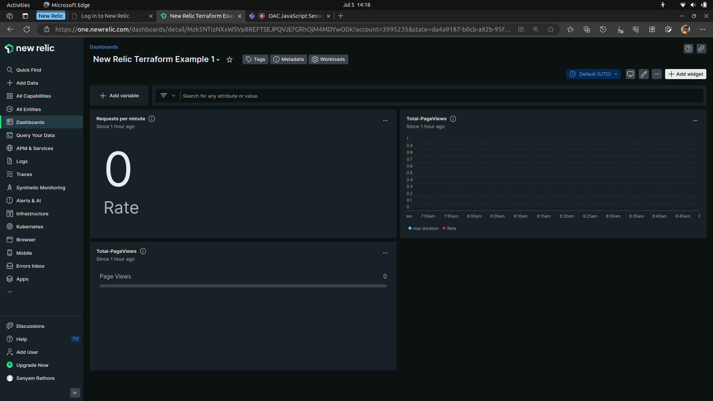
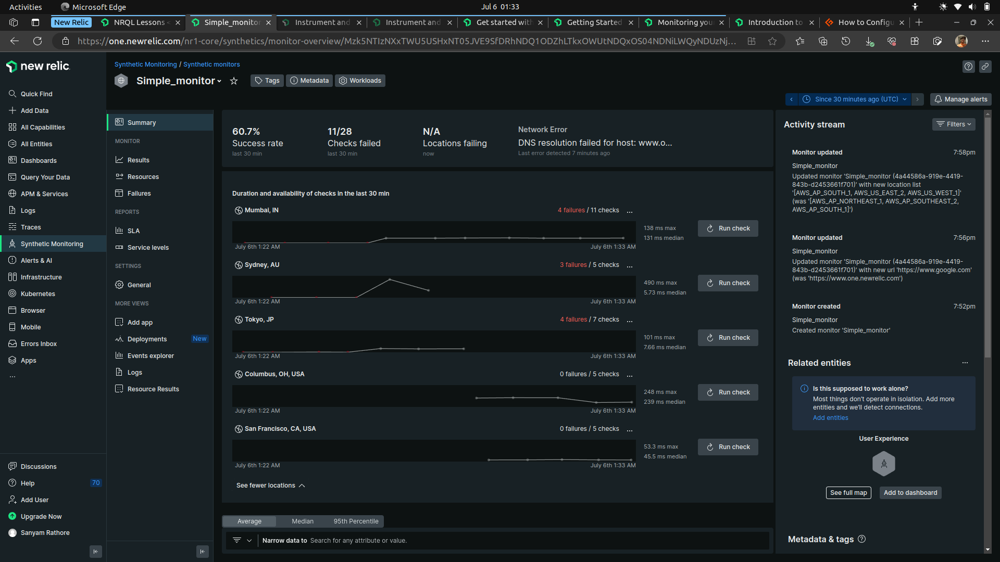
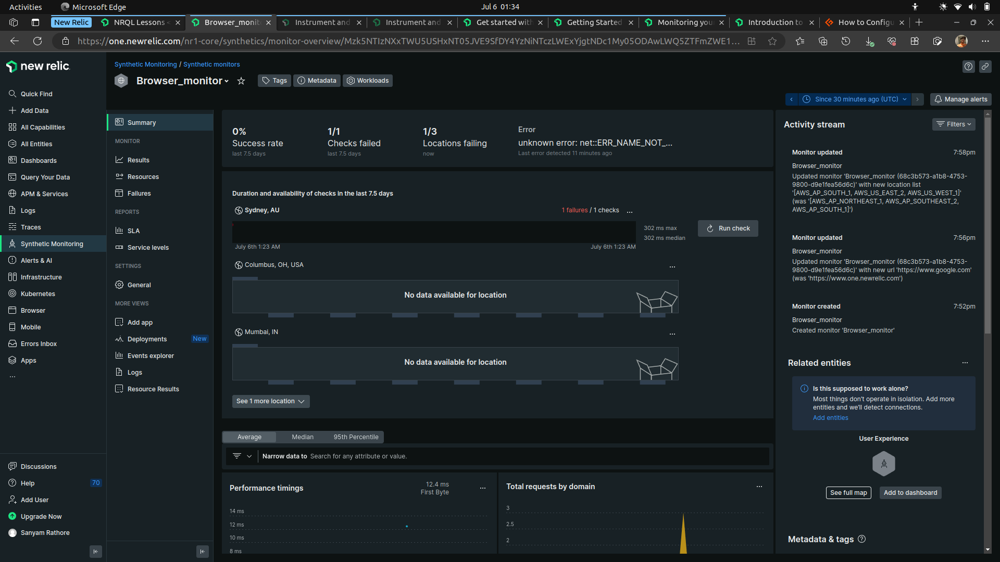

# Training on New Relic - Terraform

## Alert condition

Alerts allow us to define the conditions in our system we want to know about, letting us focus on the things we care about most.

To end response fatigue of busy DevOps teams New Relic's alerts were designed.

## Dashboard

With dashboards we can customize and understand the data we collect. Explore our data and correlate connected sources with charts and quickly learn the state of our system and applications for faster, more efficient troubleshooting.
We use Dashboards to :

* Drive insight with custom, high-density interactive visualizations with a consistent UI.
* Chart all the events and attributes from everywhere across our platform.
* Add custom attributes or send custom event types to most events in order to better understand your business, and see specific details about how your customers interact with your platform, such as page views, host transactions, etc.
* Manage your charts and dashboards easily using our quick-access CRUD menus and editing options.
* Explore and contextualize data with advanced tooltips and zoom-in functions to monitor what your systems are doing in real time.

## Synthetics Monitor

Synthetic monitoring is an approach for monitoring the performance, availability, and functionality of web applications, websites, and APIs by simulating the paths that connect users to the service. Synthetic monitoring provides insight into the application’s performance, user experience, and API functionality.
New Relic Synthetic Monitoring is a tool that simulates user interactions with websites and apps. It proactively monitors your website’s performance, alerting you to errors, failures, or anomalies that could impact user experience.

### New Relic primarily offers 7 different types of monitoring

* Availability (Ping)
* SSL Certificate Expiration (Certificate Check)
* Page Link Crawler (Broken Links Monitor)
* Page Load Performance (Simple Browser)
* User Flow/Functionality (Scripted Browser)
* Endpoint Availability (Scripted API)
* User Step Execution ( Step Monitor)

Simple Monitor

Browser Monitor
